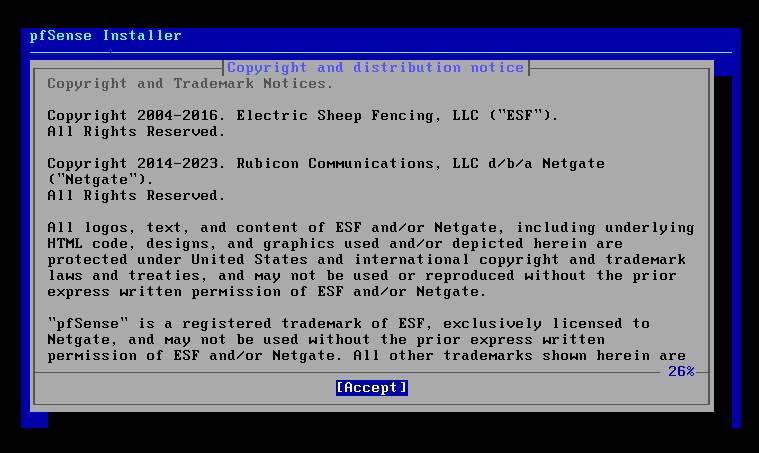
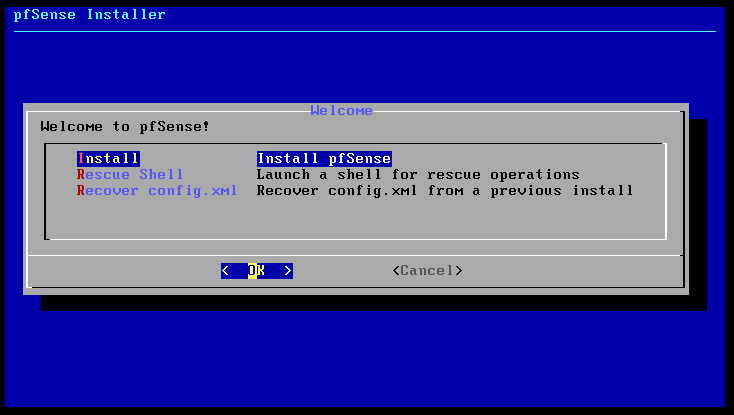
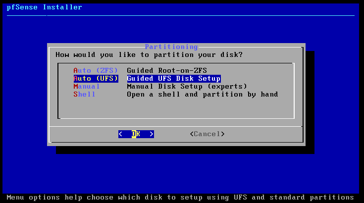
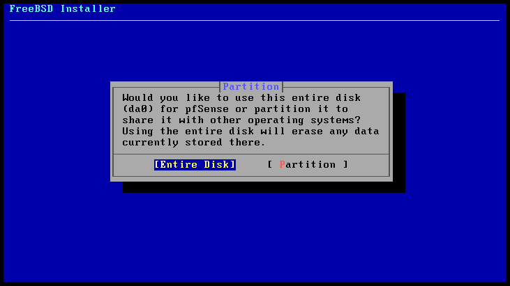
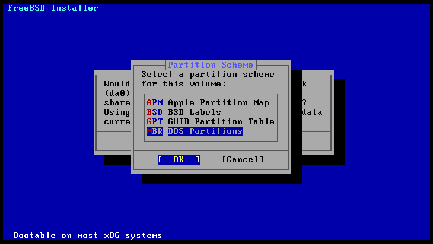
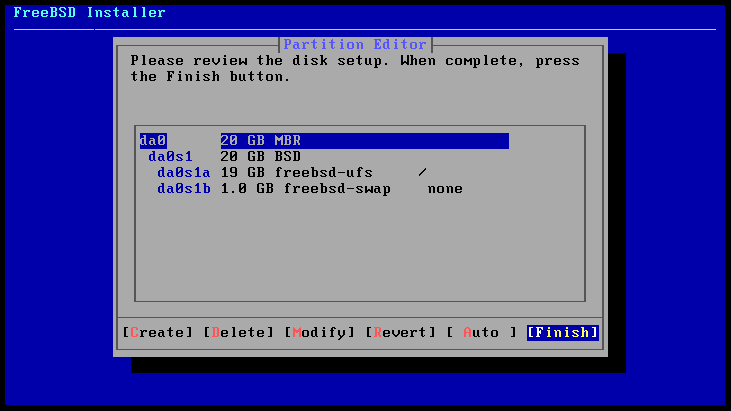
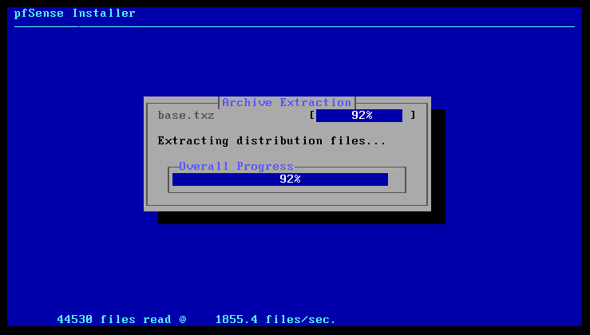
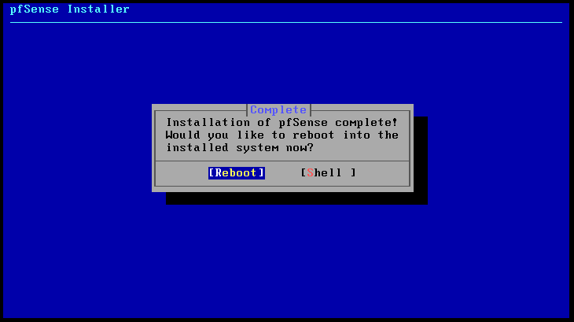
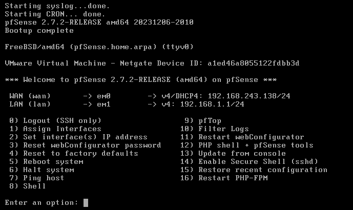
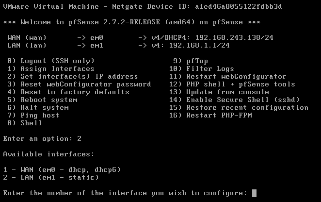

---

# RED HAT

> Red Hat é uma empresa de tecnologia que desenvolve soluções de software de código aberto, conhecida principalmente por seu sistema operacional Red Hat Enterprise Linux (RHEL). A empresa oferece produtos e serviços voltados para infraestrutura de TI, nuvem, virtualização e containers, com um forte foco em soluções baseadas em Linux.

# PFSENSE

> O pfSense é um firewall de código aberto e uma distribuição de roteamento baseada no sistema operacional FreeBSD. Ele oferece uma solução completa para gerenciamento de rede.

[__Documentação pfSense__](https://docs.netgate.com/pfsense/en/latest)

## Instalação

- Init

- Install

- Auto UFS

- Entire Disk

- MBR DOS Partition

- Finish

- Commit

- Installer Progress

- Installation Complete Reboot

- Screen Init

__WAN__:

__LAN__:

- Interface Configuration
__option 2__

- Entire Disk

- Entire Disk

### DHCP

> DHCP (Dynamic Host Configuration Protocol) é um protocolo que automaticamente atribui endereços IP e outras configurações de rede a dispositivos em uma rede.

### DNS

> DNS (Domain Name System) é o sistema que traduz nomes de domínio legíveis (como www.exemplo.com) em endereços IP numéricos (como 192.168.1.1) que os computadores usam para se comunicar entre si, funciona como uma "agenda telefônica" da internet.

### ACTIVE DIRECTORY AD

> Active Directory (AD) é um serviço da Microsoft que gerencia e organiza redes de computadores em ambientes corporativos. Ele permite que administradores controlem o acesso a recursos. O AD usa um banco de dados centralizado para armazenar informações sobre contas de usuário, computadores e outros objetos da rede, facilitando a gestão e segurança de grandes redes empresariais.

##### DOMAIN/FOREST

> __Domain__ é o grupo básico de objetos como usuários, computadores e recursos que compartilham uma mesma política de segurança e autenticação. É o nível mais comum de organização no AD.

> __Forest__ é o conjunto de um ou mais domains que compartilham uma mesma estrutura de diretório, mas podem ter políticas e regras diferentes. Um forest pode conter vários domains e serve como o nível mais alto de organização no AD.

### DOMAIN CONTROLLER OPTIONS

### FOREST FUNCTIONAL LEVEL

### DOMAIN FUNCTIONAL LEVEL

### FAILOVER

### LOAD BALANCING

### DOMAIN CONTROLLER

### IP LOOPBACK 127.0.0.1

