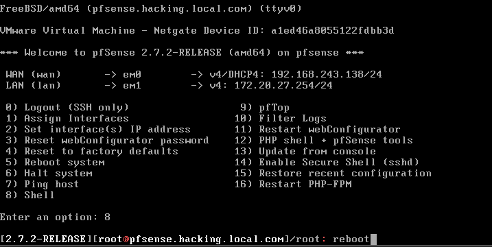
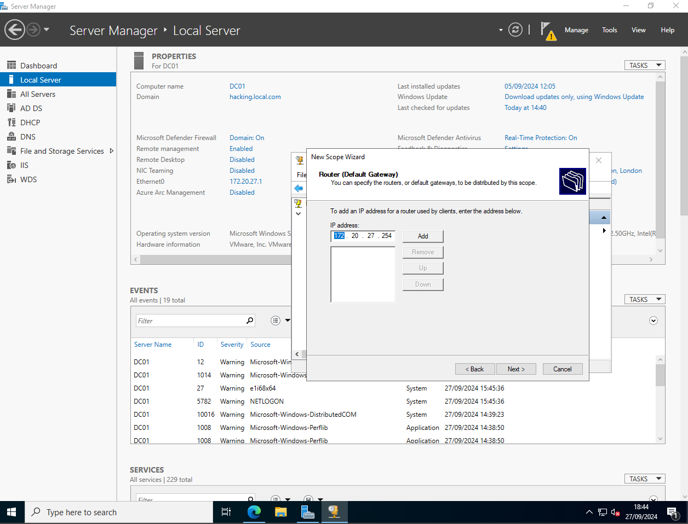

---

# RED HAT

> Red Hat é uma empresa de tecnologia que desenvolve soluções de software de código aberto, conhecida principalmente por seu sistema operacional Red Hat Enterprise Linux (RHEL). A empresa oferece produtos e serviços voltados para infraestrutura de TI, nuvem, virtualização e containers, com um forte foco em soluções baseadas em Linux.

# PFSENSE

> O pfSense é um firewall de código aberto e uma distribuição de roteamento baseada no sistema operacional FreeBSD. Ele oferece uma solução completa para gerenciamento de rede.

[__Documentação pfSense__](https://docs.netgate.com/pfsense/en/latest)

## Instalação

- Init

- Install

- Auto UFS

- Entire Disk

- MBR DOS Partition

- Finish

- Commit

- Installer Progress

- Installation Complete Reboot

- Screen Init

> __WAN__: WAN (Wide Area Network) é uma rede de comunicação que cobre uma grande área geográfica, como um país, continente ou até o mundo. Ela conecta várias redes locais (LANs) em diferentes locais, permitindo que dispositivos em regiões distantes se comuniquem.

> __LAN__: LAN (Local Area Network) é uma rede de comunicação que conecta dispositivos, como computadores e impressoras, em uma área geográfica limitada, como uma casa, escritório ou escola. Ela permite o compartilhamento de recursos e a comunicação rápida entre os dispositivos conectados.

- Interface Configuration

__option 2__

- LAN Configuration

__option 2__

__DHCP no__

__ip: 172.20.27.254/24__

> Observação: É necessário colocar a máscara subnet (como /24) junto ao ip, pois se faltar o pfsense irá perguntar qual é o subnet mask.

__For a lan ENTER for none enter__

__Configuration IPv6/DHCP6 no__

__LAN IPv6 ENTER for none enter__

__Enable DHCP for LAN no__

__Revert to HTTP yes__

__Enter para finalizar enter__

_LAN configurada._

- Teste ping do Windows Server para o pfSense

> Observação: Ambos devem estar na mesma rede, nesse cenário temos o pfsense com 2 placas de rede (1 NAT e 1 LAN Segment), e o Windows Server temos 1 placa de rede (1 LAN Segment) na mesma rede do pfsense.

- Página web do pfSense

_log in padrão pfSense_

- Setup pfSense

_Support pfSense_

_General Information pfSense_

> Observação: Configure o __Hostname__, __Domain__, Primary/Secondary __DNS__ e __Override DNS__ de acordo com a __sua__ rede, é de __sua__ responsabilidade saber sobre a rede em que estar a trabalhar.

_Time Server Information pfSense_

> __NTP__: Network Time Protocol é um protocolo utilizado para sincronizar o relógio de dispositivos em uma rede. Ele garante que todos os computadores, servidores e outros dispositivos estejam com a mesma hora exata.

_Configure WAN Interface_

> Observação: Nessa página nada foi feito, nada configurado/alterado. Scroll para baixo e clicar no botão `Next`.

> Pois essa página é de rede pública, ISP é responsável.

> __ISP__: Internet Service Provider é a empresa que fornece acesso à internet para indivíduos e organizações, fornecem a conexão à internet por meio de diferentes tecnologias.

_Configure LAN Interface_

> IP da LAN e Máscara da subrede configurados.

_Configure Password Admin_

_Reload Configuration_

_Reload Progress_

_Finish_

> Observação: Caso a página web do pfsense estiver offline após essa etapa, faça o reboot do pfsense, clicar __option 8__ para acessar ao __shell__ e digite o comando __reboot__.

_Copyright_

- Dashboard pfSense

> __FQDN__: Fully Qualified Domain Name é o nome de domínio completo, que inclui o nome do host e o nome de domínio.

> __TLD__: Top-Level Domain é a parte final de um nome de domínio na internet.

_Exemplo_:
- __pfsense__ é o __hostname__.
- __hacking.local__ é o __nome de domínio__.
- __com__ é o __TLD__.
 
---
---

- Windows Server 2022 Preferred/Alternade DNS

> Verifique na placa de rede do Windows Server se a configuração do __Preferred DNS Server__ e __Alternate DNS Server__ ou mantiveram as configurações feitas para os DNS ou foi feito o override automaticamente voltando para o __IP Loopback__ `127.0.0.1`. Se tiver feito o override, reconfigure os DNS (novamente) de acordo com a __sua__ rede, em `Internet Protocol Version 4 (TCP/IPv4)` acessando suas propriedades.

> __IP Loopback 127.0.0.1__: é um endereço IP especial que aponta para o próprio dispositivo em que ele é usado, chamado de "localhost", ele é utilizado para testar e diagnosticar a conectividade de rede local, sem precisar de uma rede externa.

- Windows Server 2022 Configurando __DHCP__

> __DHCP__: Dynamic Host Configuration Protocol é um protocolo que automaticamente atribui endereços IP e outras configurações de rede a dispositivos em uma rede.

> Em `__Tools__ > __DHCP__`, em `__IPv4__ > __New Scope...__`

> Aqui estamos no Wizard para definir o scope. Clica em `Next`.

> Configure o __Name__ e o __Description__ de acordo com a __sua__ rede. E clica em `Next`.

> Configure o __range__ entre os IPs (Start/End IP address). Configure a máscara __subnet mask__. De acordo com a __sua__ rede. E clica em `Next`.

> Aqui consegue-se configurar o __exclusão__ entre os IPs. Isso significa que o DHCP não vai utilizá-los e tens os IPs para configuração estática para outros dispositivos, como impressoras.

> No __Lease Duration__ refere-se ao período de tempo que um endereço IP é atribuído a um dispositivo em uma rede. Quando um dispositivo recebe um IP do servidor DHCP, ele "aluga" o endereço IP por um tempo definido, chamado de "lease duration". Quando o lease está perto de expirar, o dispositivo tenta renovar o IP com o servidor DHCP.

> Se a lease duration expirar sem ser renovada, o endereço IP volta a ficar disponível para ser atribuído a outro dispositivo na rede.

> Clica em `Next` após definir o seu Lease Duration.

> O __Configure DHCP Options__ refere-se à configuração de opções adicionais para os dispositivos que recebem endereços IP de um servidor DHCP. Fornecem informações adicionais; __Gateway__, __Domain Name__, __DNS Servers__ e __WINS Servers__.

> Aqui já irá configurar essas opções, pois estar sendo selecionado que sim e clicando em `Next`. Configure de acordo com a __sua__ rede.

_Ativando o Scope e Finalizando o New Scope Wizard_

*__Autorizando__ e __Atualizando__ o New Scope Criado*

- __Verificando a distribuição de IP via DHCP do Windows Server no Client Kali Linux__

> Observação: __Atualização do cenário__; todos devem estar na mesma rede, nesse cenário temos o pfsense com 2 placas de rede (1 NAT e 1 LAN Segment), o Windows Server com 1 placa de rede (1 LAN Segment), e agora o __clien t kali linux__ possui 1 placa de rede (1 LAN Segment), se o kali linux estiver em NAT __deve__ alterar para LAN Segment.

> Kali Linux deve estar no LAN Segment em vez de NAT está relacionada à necessidade de todos os dispositivos estarem na mesma rede e se comunicarem diretamente entre si.

> O LAN Segment cria uma rede local virtual onde todos os dispositivos conectados estão na mesma sub-rede.

> E também está relacionado ao DHCP e à distribuição de IPs. Quando o Kali Linux está em LAN Segment, ele está diretamente conectado à mesma rede que o servidor DHCP (como o pfSense e o Windows Server), o que permite que ele receba um endereço IP válido diretamente do servidor DHCP.

> Se o Kali Linux estivesse em NAT, o roteador NAT seria o responsável por atribuir um IP, e o cliente Kali não receberia um IP da mesma faixa usada na rede LAN Segment, quebrando a comunicação direta entre os dispositivos e prejudicando a distribuição de IPs pelo DHCP do ambiente local.

_Kali na rede NAT_

_Kali na rede LAN Segment_

> O comando __ip address__ ou __ip a__ é usado em sistemas Linux para apenas exibir os endereços IP das interfaces de rede.

### DNS

> DNS (Domain Name System) é o sistema que traduz nomes de domínio legíveis (como www.exemplo.com) em endereços IP numéricos (como 192.168.1.1) que os computadores usam para se comunicar entre si, funciona como uma "agenda telefônica" da internet.

### ACTIVE DIRECTORY AD

> Active Directory (AD) é um serviço da Microsoft que gerencia e organiza redes de computadores em ambientes corporativos. Ele permite que administradores controlem o acesso a recursos. O AD usa um banco de dados centralizado para armazenar informações sobre contas de usuário, computadores e outros objetos da rede, facilitando a gestão e segurança de grandes redes empresariais.

##### DOMAIN/FOREST

> __Domain__ é o grupo básico de objetos como usuários, computadores e recursos que compartilham uma mesma política de segurança e autenticação. É o nível mais comum de organização no AD.

> __Forest__ é o conjunto de um ou mais domains que compartilham uma mesma estrutura de diretório, mas podem ter políticas e regras diferentes. Um forest pode conter vários domains e serve como o nível mais alto de organização no AD.

### DOMAIN CONTROLLER OPTIONS

### FOREST FUNCTIONAL LEVEL

### DOMAIN FUNCTIONAL LEVEL

### FAILOVER

### LOAD BALANCING

### DOMAIN CONTROLLER
